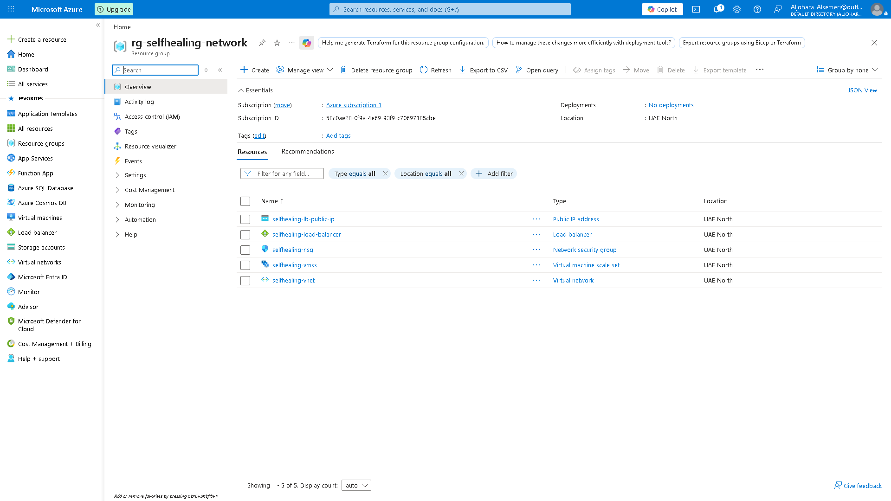
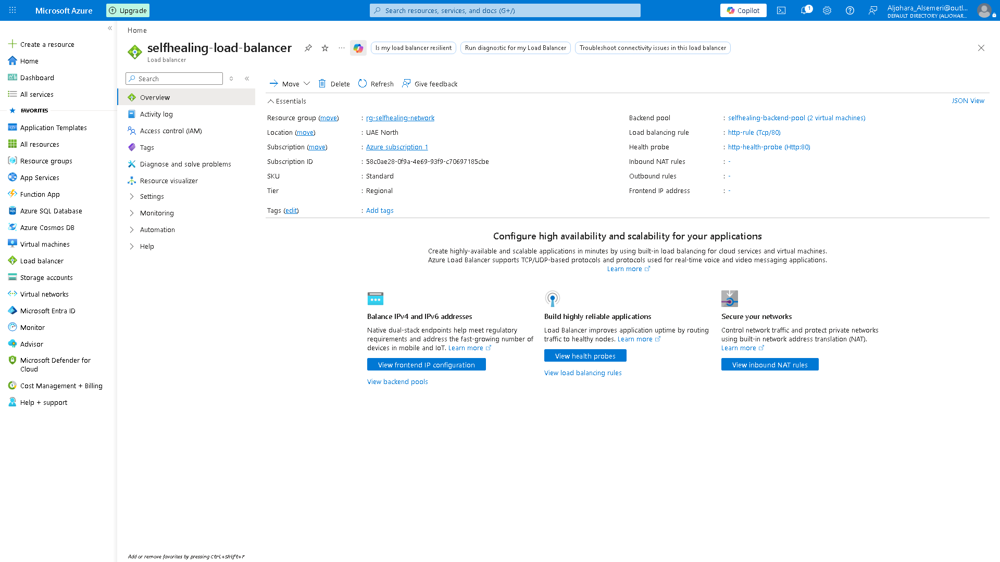
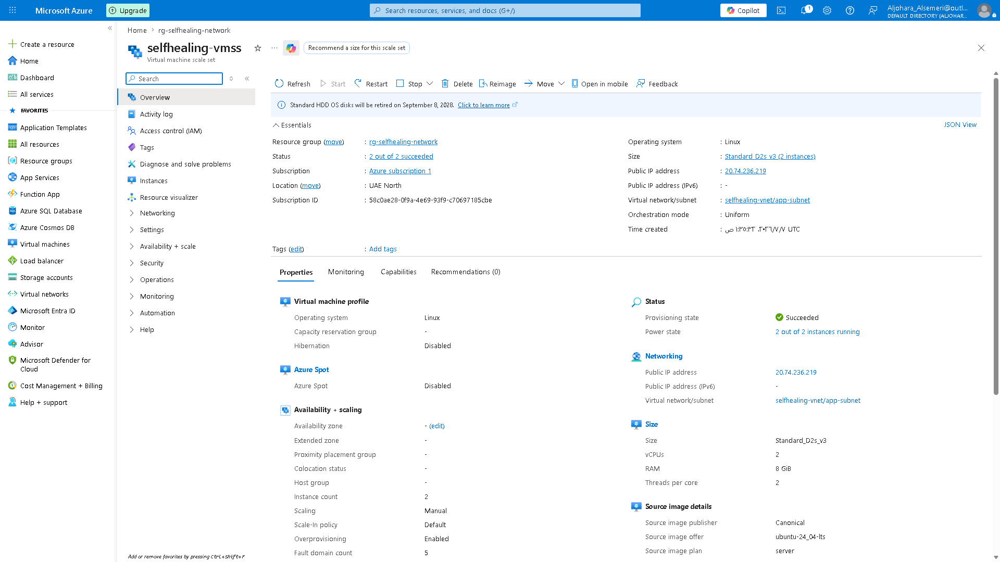
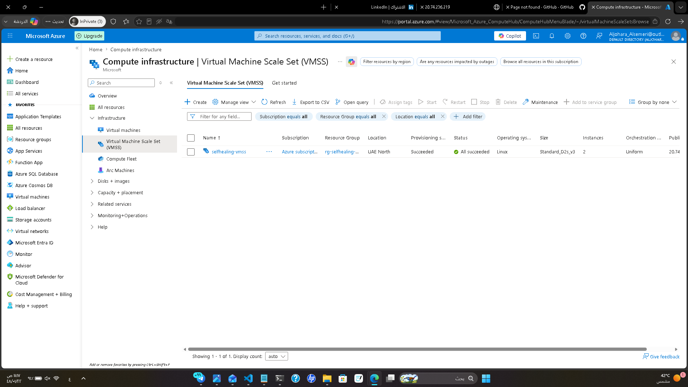
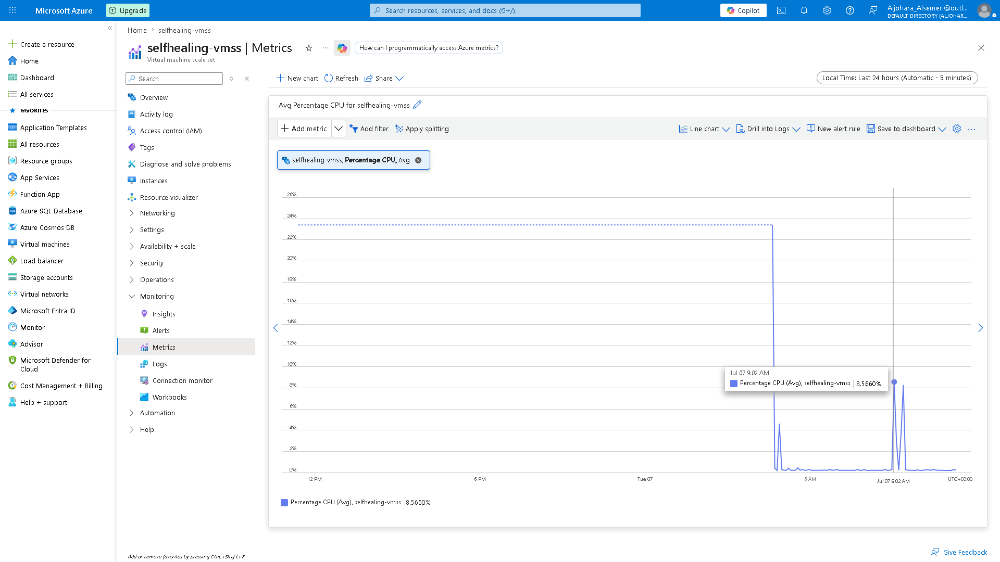
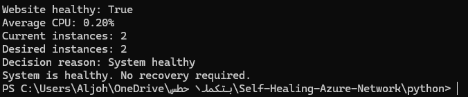
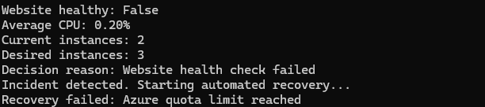
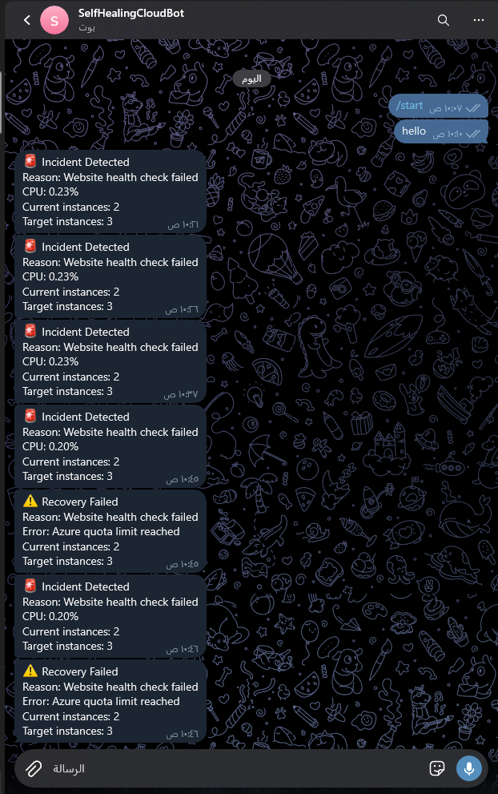
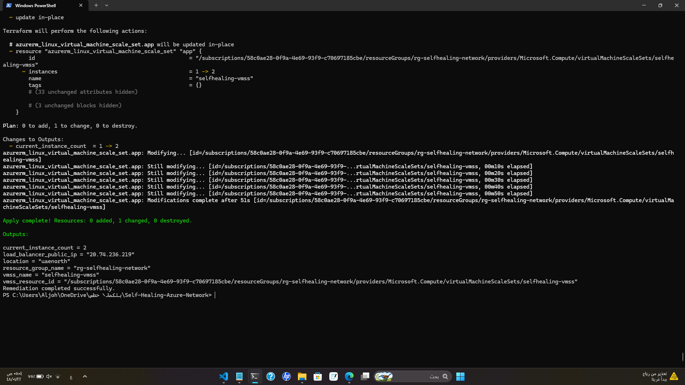

# Intelligent Self-Healing Cloud Infrastructure on Azure

Al-Jawharah Mohammed Alsumayri

Cloud Infrastructure & Automation
Azure • Terraform • Python • SRE Concepts

## Overview

I built a self-healing Azure infrastructure using Terraform and Python to explore infrastructure automation, monitoring, and automated recovery techniques. The environment consists of a Virtual Machine Scale Set behind an Azure Load Balancer, with a Python monitoring service responsible for detecting failures and initiating recovery actions.

The platform continuously monitors website availability and infrastructure health. Python handles monitoring, incident detection, automated recovery actions, and administrator notifications, while Terraform provisions and manages the Azure infrastructure.

## Technologies

- Microsoft Azure
- Terraform
- Python
- Azure Virtual Machine Scale Sets (VMSS)
- Azure Load Balancer
- Azure Virtual Network (VNet)
- Azure Network Security Groups (NSG)
- Ubuntu Linux
- Azure Monitor
- Telegram Bot API
- Azure Identity
- Azure SDK for Python

## Architecture

```text
User
  |
Public IP
  |
Load Balancer
  |
VM Scale Set
  |
Virtual Network
  |
Network Security Group

         |
         v

Python Monitoring Engine
         |
         +------ Website Health Checks
         |
         +------ Azure Monitor Metrics
         |
         +------ Incident Detection
         |
         +------ Self-Healing Decisions
         |
         +------ VMSS Recovery Actions
         |
         +------ Telegram Notifications
```

## Architecture Diagram

The infrastructure consists of an Azure Load Balancer connected to a Virtual Machine Scale Set within a secured Virtual Network. A Python monitoring engine continuously evaluates website availability and infrastructure health, collects Azure Monitor metrics, detects incidents, triggers automated recovery actions, and delivers real-time notifications through Telegram.

## Workflow

1. Monitor website availability using HTTP health checks.
2. Collect infrastructure metrics from Azure Monitor.
3. Detect incidents and service degradation.
4. Generate Telegram notifications.
5. Trigger automated recovery actions.
6. Attempt VMSS scaling when required.
7. Handle quota limitations and recovery failures.
8. Verify recovery success.
9. Report final system status.

## Self-Healing Features

### Website Health Monitoring
The system continuously verifies service availability using HTTP health checks.

### Automated Incident Detection
Failures are automatically detected and classified.

### Telegram Notifications
Real-time incident and recovery alerts are delivered to administrators.

### Automated Recovery
The platform attempts recovery actions without human intervention.

### Failure Handling
Azure quota limitations and recovery failures are handled gracefully and reported automatically.

## What I Learned

Through this project I gained hands-on experience with:

- Terraform Infrastructure as Code (IaC)
- Azure Virtual Machine Scale Sets (VMSS)
- Azure Load Balancer configuration
- Azure Monitor metrics collection
- Python automation and Azure SDK integration
- Failure detection and automated remediation workflows
- Handling cloud platform limitations and quota restrictions
- Building self-healing infrastructure concepts inspired by SRE practices

## Challenges

One of the main challenges during this project was Azure regional quota limitations, which prevented automated VM Scale Set scaling during recovery testing.

Instead of stopping the workflow, I implemented error handling and notification logic to detect the failure, report it through Telegram, and keep the monitoring process running without interruption.

This helped demonstrate the importance of resiliency, observability, and graceful failure handling in cloud environments.


## Project Objectives

The main objective of this project was to explore how cloud infrastructure can automatically detect failures, notify administrators, and initiate recovery actions without manual intervention.

The project combines Infrastructure as Code (Terraform), monitoring, alerting, and automation concepts commonly used in Cloud Operations and Site Reliability Engineering (SRE).


## Results

### Monitoring

- Website availability monitored continuously.
- Azure Monitor metrics collected automatically.

### Incident Detection

- Service disruption detected successfully.
- Automated incident workflow triggered.

### Alerting

- Real-time Telegram notifications delivered.
- Incident and recovery events reported automatically.

### Recovery Handling

- Automated recovery actions executed.
- Azure quota limitations detected and handled gracefully.

### System Status

- Infrastructure remained operational.
- Monitoring continued without interruption.

## Recovery Demonstration

### Incident Detection

- Website became unavailable.
- Health check failed.
- Incident alert generated.

### Automated Recovery Attempt

- Self-healing workflow triggered.
- Recovery action initiated.
- Telegram notification delivered.

### Failure Handling

- Azure quota limitation detected.
- Recovery failure reported.
- Administrator notified automatically.

### Healthy State

- Website availability restored.
- Monitoring returned to normal operation.

## Screenshots

### Resource Group Overview

Displays all Azure resources deployed for the self-healing infrastructure, including the Virtual Machine Scale Set, Load Balancer, Virtual Network, Public IP, and Network Security Group.



### Load Balancer Overview

Illustrates the Azure Load Balancer configuration, backend pool association, and health probe used to distribute traffic across VM instances and maintain service availability.



### VM Scale Set Overview

Shows the Azure Virtual Machine Scale Set responsible for hosting application workloads and supporting automated recovery actions.



### VM Scale Set Instances

Shows the active Virtual Machine Scale Set instances running in Azure, including provisioning status, health state, and operational availability.



### Azure Monitor Metrics

Shows real-time CPU utilization metrics collected from Azure Monitor and used by the monitoring engine to evaluate infrastructure health and support self-healing decisions.



### Healthy System State

Demonstrates the monitoring engine successfully verifying website availability and infrastructure health under normal operating conditions.



### Incident Detection

Shows the monitoring engine detecting a website availability failure and automatically triggering the self-healing workflow.



### Telegram Incident Alert

Real-time incident notifications delivered through Telegram immediately after detecting service disruption and recovery events.



### Recovery Failure Handling

Demonstrates intelligent error handling when Azure scaling operations were blocked by regional quota limitations. The system captured the failure and automatically notified the administrator.


### Automated Remediation Success

Demonstrates a successful remediation workflow where Terraform automatically scaled the Virtual Machine Scale Set from one instance to two instances.



## Contact

Email: Aljohara_Alsemeri@outlook.sa

GitHub:
https://github.com/aljawharah-m

LinkedIn:
https://www.linkedin.com/in/aljawharah-alsumayri-219265375/
